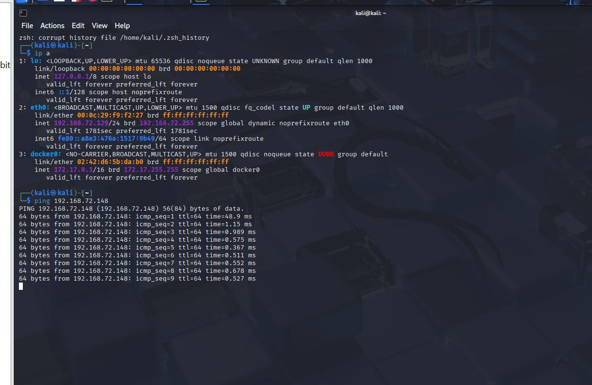
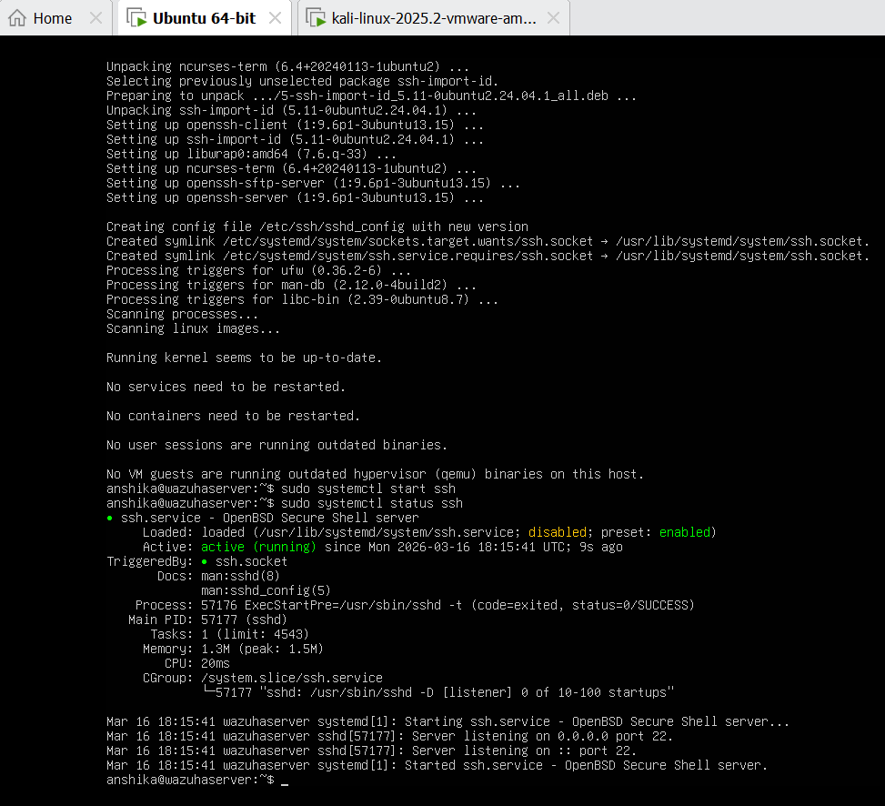
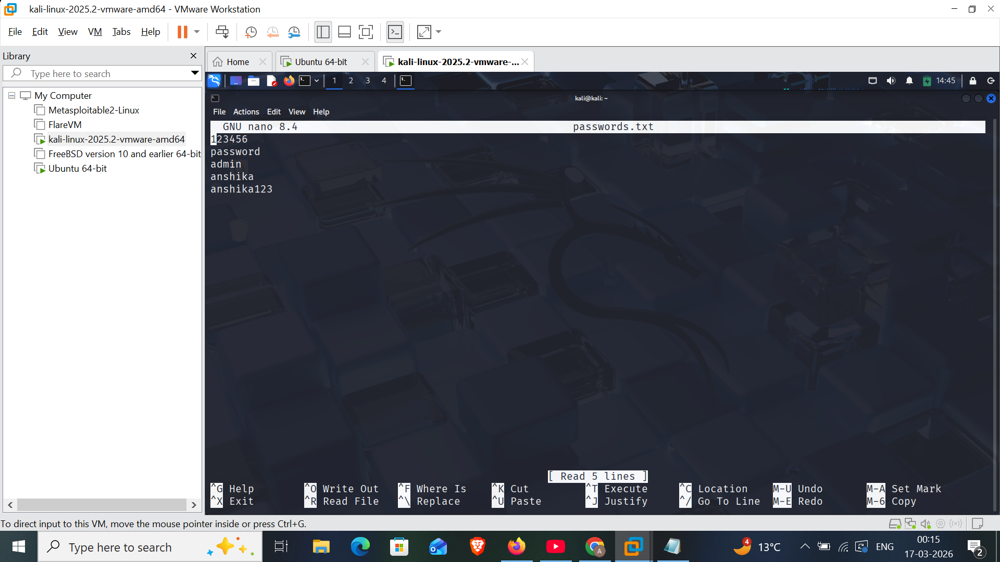
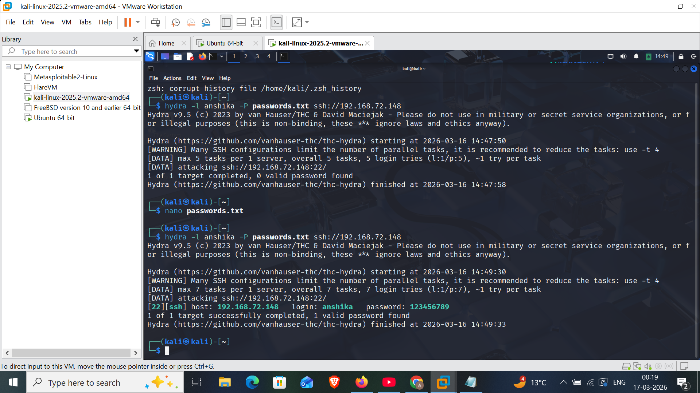
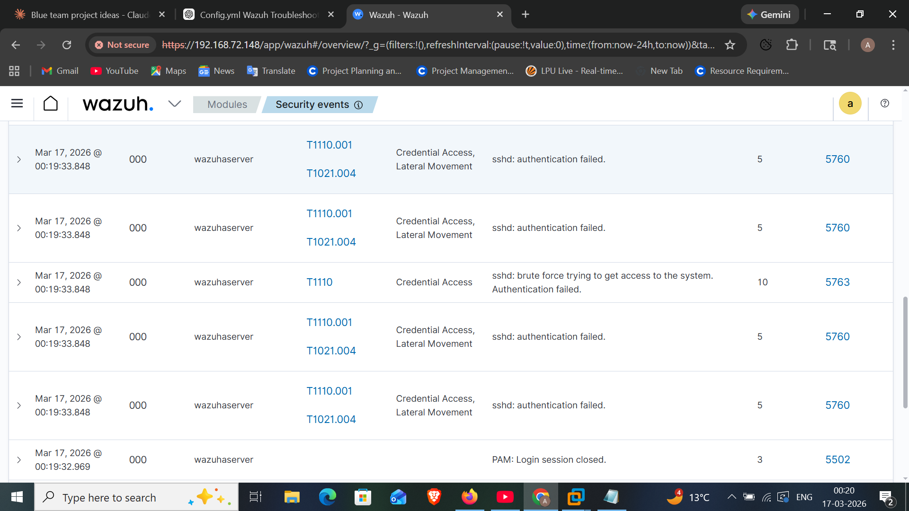
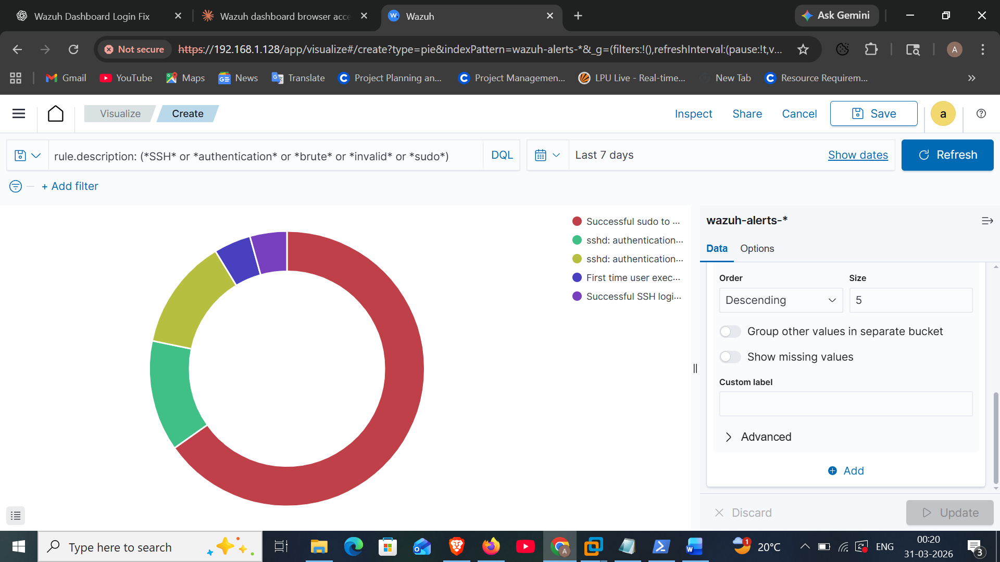

This project demonstrates the deployment of a Wazuh SIEM environment and detection of simulated cyber attacks.

The lab includes:

Wazuh SIEM deployment
SSH brute force attack simulation using Hydra
Security event monitoring
Log analysis
Real-time authentication monitoring
Custom dashboard creation
Lab Architecture:

Kali Linux (Attacker)
↓
SSH Brute Force Attack (Hydra)
↓
Ubuntu Server (Wazuh Agent)
↓
Wazuh Manager & Indexer
↓
Wazuh Dashboard (Security Monitoring)

Tools Used :
Wazuh SIEM
Kali Linux
Hydra
OpenSSH
VMware
Ubuntu Server
Features :
Detects successful SSH logins
Detects failed SSH login attempts
Detects invalid/non-existent user login attempts
Detects sudo authentication failures
Detects repeated failed sudo attempts
Provides real-time Wazuh dashboards for faster alert triage
Visualizes authentication events using pie charts, bar charts, and tables
Attack Simulation
SSH Brute Force Attack

The Hydra tool was used from Kali Linux to simulate a brute force attack against the SSH service running on the monitored Ubuntu server.

Command used:

hydra -l anshika -P passwords.txt ssh://192.168.72.148
Successful SSH Login Detection

A valid SSH login was performed from Kali Linux to the Ubuntu server using correct credentials. Wazuh successfully generated alerts for successful SSH authentication events.

Command used:

ssh anshika@192.168.72.148
Invalid User Login Attempt

An SSH login attempt was made using a non-existent username to simulate unauthorized access attempts.

Command used:

ssh fakeuser@192.168.72.148

Wazuh generated alerts such as:

sshd: Attempt to login using a non-existent user
PAM: User login failed
Sudo Authentication Failure Detection

Failed sudo authentication attempts were simulated on the Ubuntu server by intentionally entering the wrong password multiple times.

Command used:

sudo apt update

Wazuh generated alerts such as:

Failed attempt to run sudo
Three failed attempts to run sudo
Security Events Detected

The following security events were detected in the Wazuh dashboard:

Successful SSH login detected
PAM: User login failed
Failed attempt to run sudo
Three failed attempts to run sudo
sshd: Attempt to login using a non-existent user
Multiple SSH authentication failures
Authentication brute force activity
Real-Time Dashboard Visualizations

Several custom visualizations were created in the Wazuh Dashboard to improve alert triage and monitoring efficiency.

The dashboard includes:

Pie chart showing authentication attack categories
Bar chart showing authentication events over time
Table displaying top source IP addresses
Metric for total failed logins
Metric for successful SSH logins
Authentication alert trend monitoring
Sample Dashboard Categories
Successful SSH Login
Failed SSH Authentication
Invalid User Attempt
Sudo Authentication Failure
Repeated Failed Sudo Attempts
Project Outcome

This project demonstrates how Wazuh can be used to monitor authentication-related threats in real time.

By creating custom visualizations and monitoring multiple authentication attack categories, the project helps reduce alert triage time and improve security visibility.

## Attack Demonstration

### Kali Attacker Machine

### SSH Service Running on Target

### Password Wordlist

### Hydra Brute Force Attack

### Wazuh Alert Detection

### Authentication Pie Chart

## Threat Detection Mapping (MITRE ATT&CK)

The simulated attack in this lab aligns with the following MITRE ATT&CK technique:

| Attack Technique | MITRE ID | Description |
|-----------------|----------|-------------|
| SSH Brute Force | T1110 | Attempting multiple password combinations to gain unauthorized access |

Wazuh SIEM detects this behavior by monitoring authentication logs and identifying multiple failed login attempts.
